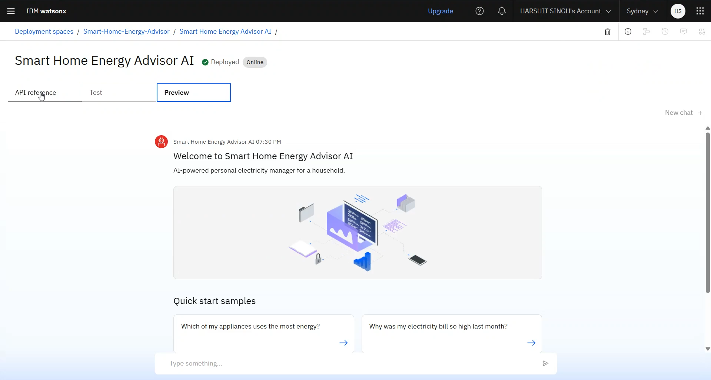

# Smart Home Energy Advisor Agent

💡 Smart Home Energy Advisor Agent
An AI-powered assistant that acts as your personal electricity manager. Built using IBM watsonx.ai and IBM Granite Models, this agent analyzes your household's energy data to answer questions, identify consumption patterns, and provide personalized tips to help you save energy and reduce your electricity bills.

---

---

## 🧩 Problem Statement

Many households struggle to understand their electricity consumption. Energy bills are often confusing, and it's difficult to know which appliances use the most power or when the best time to use them is. This lack of insight leads to wasted energy, higher costs, and a larger carbon footprint.

---

## 💡 Proposed Solution

An AI agent, built on IBM Cloud, that connects to household energy data. Using a powerful IBM Granite LLM and Retrieval-Augmented Generation (RAG), the agent can understand and answer natural language questions about energy use. It provides clear, data-driven advice, making it easy for anyone to make smarter energy decisions.

---

## 🧠 Technologies Used

- IBM watsonx.ai Studio
- IBM Granite Foundation Model (LLM)
- Vector Index for Retrieval-Augmented Generation
- Household Power Consumption Dataset (.txt format)
- NLP (Natural Language Processing)
- IBM Cloud Object Storage

---

## ☁️ IBM Cloud Services Used

- Watsonx.ai Studio
- IBM Granite Model
- Watsonx Vector Index
- IBM Cloud Lite Account
- IBM Cloud IAM
- IBM Cloud Object Storage

---

## 👥 End Users

- Homeowners and renters looking to save on electricity bills
- Environmentally conscious individuals aiming to reduce their carbon footprint
- Students and users learning about energy management
- Smart home enthusiasts
- Utility companies offering value-added services

---

## 🌟 WOW Factors

- Uses RAG to provide answers directly from your home's energy data
- Built entirely on IBM Cloud's powerful watsonx.ai platform
- Can be extended with tools to fetch real-time weather data or general energy-saving tips
- Identifies which specific appliance groups (kitchen, laundry) are using the most power
- Provides clear, actionable advice in plain language

---

## 🧪 Key Features

- Document-based Q&A via Vector Index
- Powered by IBM Granite LLM for natural language understanding
- Built-in NLP support
- Responds gracefully to off-topic/irrelated questions
- Covers real energy consumption data (power, voltage, sub-metering)

---

##🚀 How It Works

1. User inputs a query (e.g., “Which appliances used the most energy yesterday afternoon?”).
2. IBM Granite LLM processes the language.
3. Vector Index retrieves trusted content from the uploaded energy data file.
4. Agent responds with a grounded, natural-language answer.

---

## 🖼️ Screenshots
###🔹 Setting up..

###🔹 Agent Instructions...

###🔹 Adding the Energy Data via Vector Index...

###🔹 Tools used & Testing...

###🔹 Deployment & Preview...

###🔹 API References after Deployment...

###🔹 Resources List...

---

## Recordings(watch to build on your own)
▶️ [Building, Testing & Deployment](https://youtu.be/5fXR15PDv6k)
<iframe width="560" height="315" src="https://www.youtube.com/embed/5fXR15PDv6k?si=9WHr4Mg_4D8__Hwa" title="YouTube video player" frameborder="0" allow="accelerometer; autoplay; clipboard-write; encrypted-media; gyroscope; picture-in-picture; web-share" referrerpolicy="strict-origin-when-cross-origin" allowfullscreen></iframe>

---

## 📌 How to Run or Deploy

1. Log in to IBM Cloud Lite: https://cloud.ibm.com
2. Launch Watsonx.ai Studio
3. Create a new AI Agent
4. Upload the energy_consumption_knowledge.txt file to a Vector Index
5. Choose Tools for web search (Google,Wikipedia,DuckDuckGo etc..)
6. Configure agent instructions and topics (restricting AI from answering off-topic questions politely)
7. Test in the preview panel
8. Deploy via web snippet, Streamlit, or custom web UI

---

## 🛣️ Future Scope
- WhatsApp or mobile app integration
- Speech-to-text input for voice-driven queries
- Automatic monthly report generation
- Real-time IoT integration with smart plugs
- Gamification with energy-saving goals

---

## 🔗 Useful Links

- [IBM Cloud Lite](https://cloud.ibm.com/registration)
- [IBM Watsonx.ai](https://www.ibm.com/products/watsonx-ai)
- [RBI Official Website](https://www.rbi.org.in)
- [NPCI FAQs](https://www.npci.org.in/what-we-do/upi/faqs)
- [IBM SkillsBuild](https://skillsbuild.org)

---

##⚖️ License

This project is licensed under the [MIT License](LICENSE).

---

> Created with 💙 during the Edunet Foundation – AICTE Internship 2025 by **Harshit Singh**
